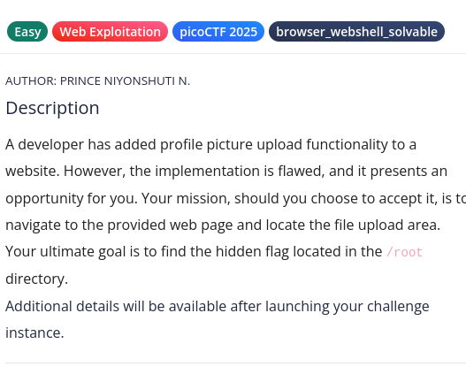
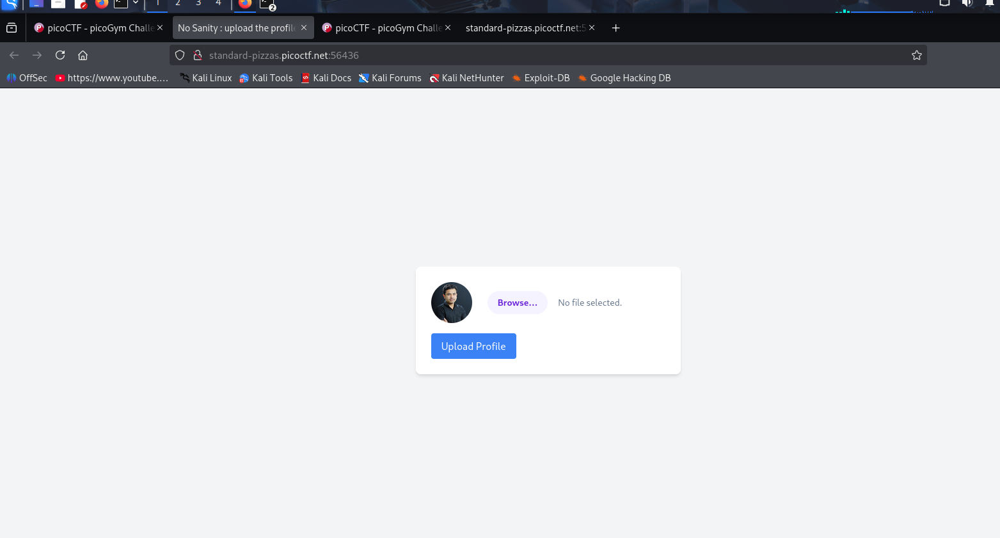
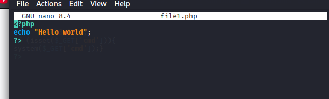
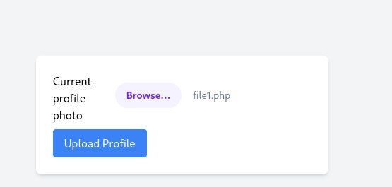
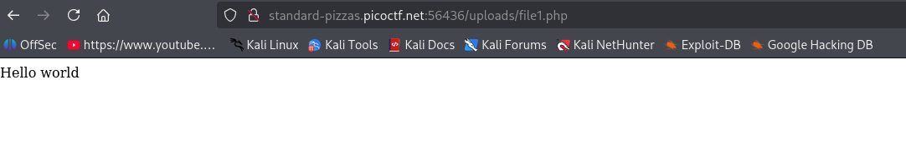
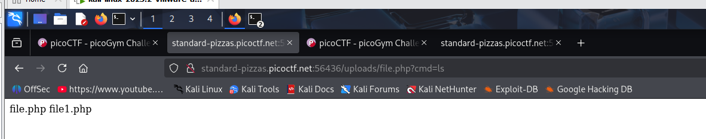
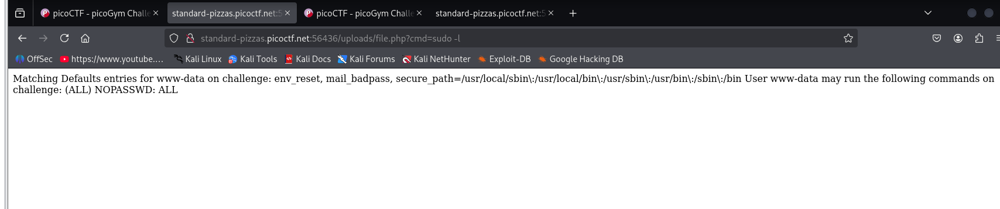
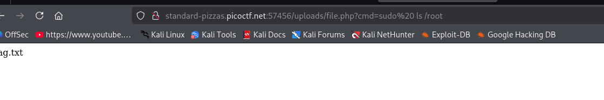

#Sample web challege

Problem

Tools: web browser for manual testing

step 1. Launch the website

Approach
I first create php file and upload on the profile picture
I made the php file and upload to web 

After uploading, The file1.php the uploaded Path is displayed: uploads/file1.php  was displayed
I modified the website link from http://standard-pizzas.picoctf.net:56436/upload.php
to http://standard-pizzas.picoctf.net:56436/uploads/file1.php that shows the website have unrestricted file upload that exposes it  remote code execution

create another PHP file  to allow me enter commands to traverse the files in the website

when I run sudo command, it shows you don't need a password to run any commands on the website

Then run sudo ls /root as shown below  and flag.txt was found

I finally run the sudo cat /root/flag.txt in website to get the flag